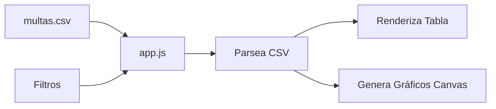

# Visualizador de Multas Ambientales Chile

Sitio web simple que muestra multas ambientales chilenas en tabla interactiva con gráficos.

## Cómo funciona

## Uso

1. Coloca `multas.csv` en el mismo directorio
2. Inicia servidor HTTP: `python -m http.server 8000`
3. Abre `http://localhost:8000`

## Características

- Tabla sorteable por columna
- Filtros: búsqueda, categoría, región
- 4 gráficos: por categoría, timeline, regiones top 10, empresas top 10
- Vanilla JS/CSS/HTML, sin dependencias
